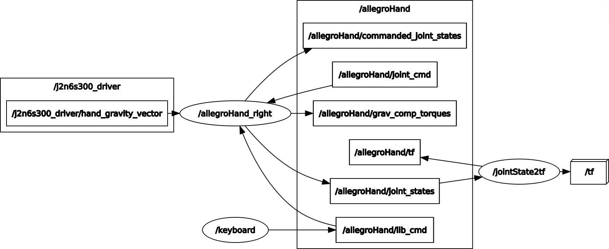

# Allegro Hand
This repository provides ROS support for the Allegro Hand. The packages were developed on Ubuntu 18.04 with ROS Melodic and haven't been tested in other environments.

## Contents
1. [Summary](#summary)
2. [Installing Drivers](#drivers)
3. [Package Descriptions](#package_descriptions)

## Summary <a name="summary"></a>
This repository was based on the packages found in [NYU-robot-learning](https://github.com/NYU-robot-learning)'s [Allegro-Hand-Controller-DIME](https://github.com/NYU-robot-learning/Allegro-Hand-Controller-DIME) repo and using the description found in [simlabrobotics](https://github.com/simlabrobotics)'s [allegro_hand_model_v4](https://github.com/simlabrobotics/allegro_hand_model_v4) repo.

Using only [Allegro-Hand-Controller-DIME](https://github.com/NYU-robot-learning/Allegro-Hand-Controller-DIME), the robot was controlled by using a node that subscribed to `/allegroHand/joint_cmd` and would handle the PD+grav_comp controller.
<p align="center">
  
</p>
To launch this controller, you need to execute:

```
roslaunch allegro_hand allegro_hand.launch
```

I have added the ability to use `ros_control` framework by writing a hardware interface for the allegro hand. This allows to use the variety of controllers that the framework offers. To launch this controller, modify the 

## Installing Drivers [[1]](#1) <a name="drivers"></a>
Before setting up the controller, we need to ensure that we have all the drivers necessary for establishing communication over the PCAN channel. Make sure to install the following dependencies first before setting up the allegro controller package.

1. Install these C++ dependencies:
   ```
   sudo apt-get install cmake gcc g++ libpopt-dev
   ```
2. Set up the necessary drivers using the following commands:
   ```
   cd ../
   mkdir drivers && cd drivers
   
   wget https://www.peak-system.com/fileadmin/media/linux/files/peak-linux-driver-8.12.0.tar.gz
   tar -xvzf peak-linux-driver-8.12.0.tar.gz
   cd peak-linux-driver-8.12.0
   make clean
   make NET=NO_NETDEV_SUPPORT
   sudo make install 
   sudo modprobe pcan
   cd ..
   wget https://www.peak-system.com/quick/BasicLinux
   tar -xvzf BasicLinux
   cd PCAN-Basic_Linux-4.5.4/libpcanbasic
   make
   sudo make install
   ``` 
3. Test the installation of the drivers using the following command:
   ```
   cat /proc/pcan
   ```
   You will be able to see the pcan driver stream data if you are connected to a PCAN device.
4. You can also run the following command to list all the PCAN devices connected to the system:
   ```
   ls -l /dev/pcan*
   ```
5. If you do not see any available files, you may need to run:
   ```
   sudo ./driver/pcan_make_devices 2
   ```
6. After installing the drivers install [ROS](http://wiki.ros.org/noetic/Installation/Ubuntu) followed by it's PCAN package:
   ```
   sudo apt-get install ros-melodic-libpcan 
   ```

## Package Descriptions <a name="package_descriptions"></a>


## References 
<a id="1">[1]</a> 
[NYU-robot-learning/Allegro-Hand-Controller-DIME](https://github.com/NYU-robot-learning/Allegro-Hand-Controller-DIME/blob/main/README.md?plain=1)
